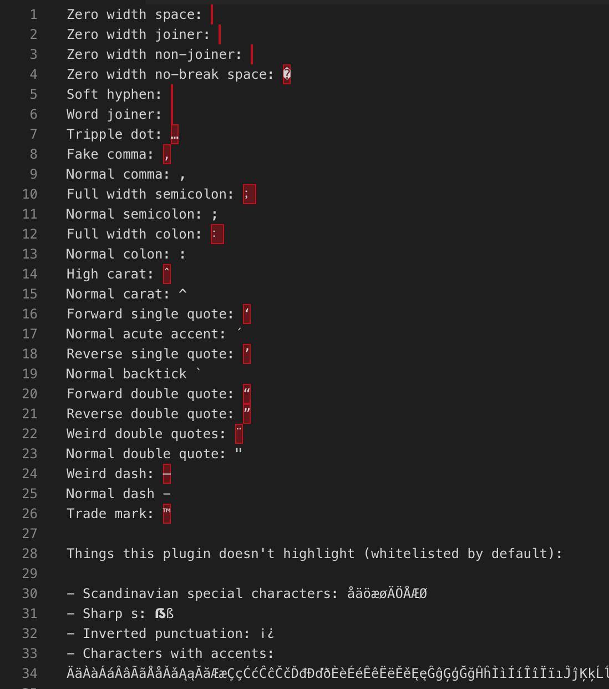

# Highlight dodgy characters

Highlight all non-ascii characters (port of [Highlight Dodgy Characters](https://packagecontrol.io/packages/Highlight%20Dodgy%20Chars) from Sublime Text)



## Features

It highlights all the non-ascii characters, including dashes, fancy quotes and emojis. 

Inspired from [Highlight Bad Chars](https://github.com/WengerK/vscode-highlight-bad-chars/)

### Whitelisting

You can override the whitelist of characters that will not be highlighted in your workspace or user settings:
```
"highlight-dodgy-characters.whitelist": "´€£¡¿äàáâãåǎąăāæçćĉčđďðèéêëěęēĝģğĥìíîïīıĵķĺļłľñńňņöòóôõőōøœŕřẞßśŝşšșťţþțüùúûűũūųůŵýÿŷźžż"
```

### Examples

An example file that contains dodgy characters can be found [here](./src/test/examples.txt)